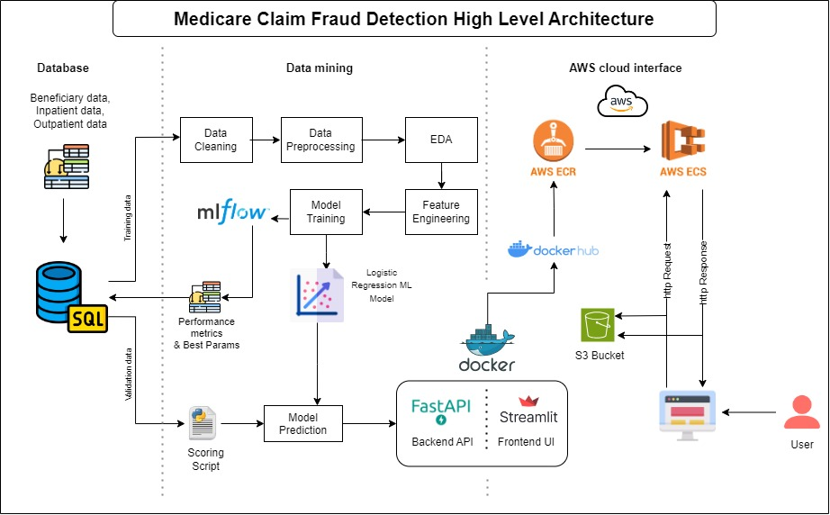

# Medicare Claim Fraud Prediction

Medicare fraud is a significant issue in healthcare, costing billions of dollars each year. Fraudulent claims burden the system, leading to financial losses and undermining trust in medical services. Detecting fraudulent Medicare claims early and accurately is critical for reducing these financial impacts and ensuring that legitimate claims are processed efficiently. The goal is to leverage advanced data analysis techniques, feature engineering, and predictive algorithms to identify suspicious patterns that may indicate fraudulent activity.

**Data:** Medicare claims dataset (https://www.cms.gov/data-research/statistics-trends-and-reports/medicare-claims-synthetic-public-use-files)

**Project Overview**
This project uses logistic regression to classify claims as fraudulent or non-fraudulent. The model achieves a recall score of 65% and is deployed on AWS Elastic Container Service (ECS) with Docker. The front-end is developed using Streamlit, while FastAPI handles the backend API for prediction services.

## Technologies Used

1. Machine Learning: Logistic Regression
2. Frontend: Streamlit (for web UI)
3. Backend: FastAPI (for API services)
4. Containerization: Docker
5. Cloud: AWS ECS, AWS S3
6. Model Tracking: MLflow

## Architecture



User Input: User interacts with the Streamlit web UI for claim data entry.

Backend API: FastAPI processes the input, triggering the fraud prediction model.

ML Model: Logistic Regression model, loaded via MLflow, predicts if the claim is fraudulent.

Storage: All processed data is stored in AWS S3.

Deployment: The application is dockerized and deployed on AWS ECS.

## Installation

To run the project locally, follow these steps:

1. Clone the repository:

```bash
git clone https://github.com/rohitkosamkakr18/Medicare-Claim-Fraud-Detection.git
cd Medicare-Claim-Fraud-Detection/src
```

2. Build and run the Docker container:

```bash
docker build -t medicare-fraud-detection .
docker run -p 8501:8501 -p 8000:8000 medicare-fraud-detection
```

3. Install dependencies (if not using Docker):

```bash
pip install -r requirements.txt
```

4. Run FastAPI and Streamlit:

```bash
uvicorn main:app --host 0.0.0.0 --port 8000  # For FastAPI backend
streamlit run app_ui.py --server.port 8501    # For Streamlit frontend
```

## Usage

Access the Streamlit frontend for predictions at: http://localhost:8501

FastAPI documentation is available at: http://localhost:8000/docs

Submit Medicare claim data through the web interface to get predictions on whether a claim is fraudulent.

## Deployment
This project is deployed using AWS Elastic Container Service (ECS) with Docker. The following services are used in the deployment process:

**AWS ECS**: For managing the Docker container cluster.

**AWS S3**: For storing the input/output data.

**AWS ECR**: For storing the Docker images.

## Steps for deployment:

1. Push the Docker image to AWS ECR.

2. Create an ECS cluster and task definition to run the Docker container.

3. Expose ports 8000 (FastAPI) and 8501 (Streamlit) to make the service publicly accessible.

## Model Performance
- Model: Logistic Regression

- Metric: Recall (65%)

- Capture Rate: 72% in the top 3 percentile.
